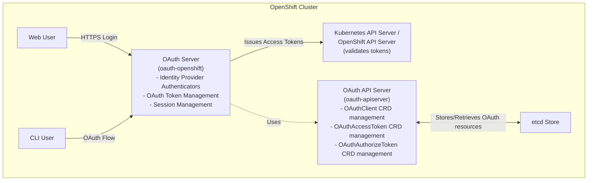
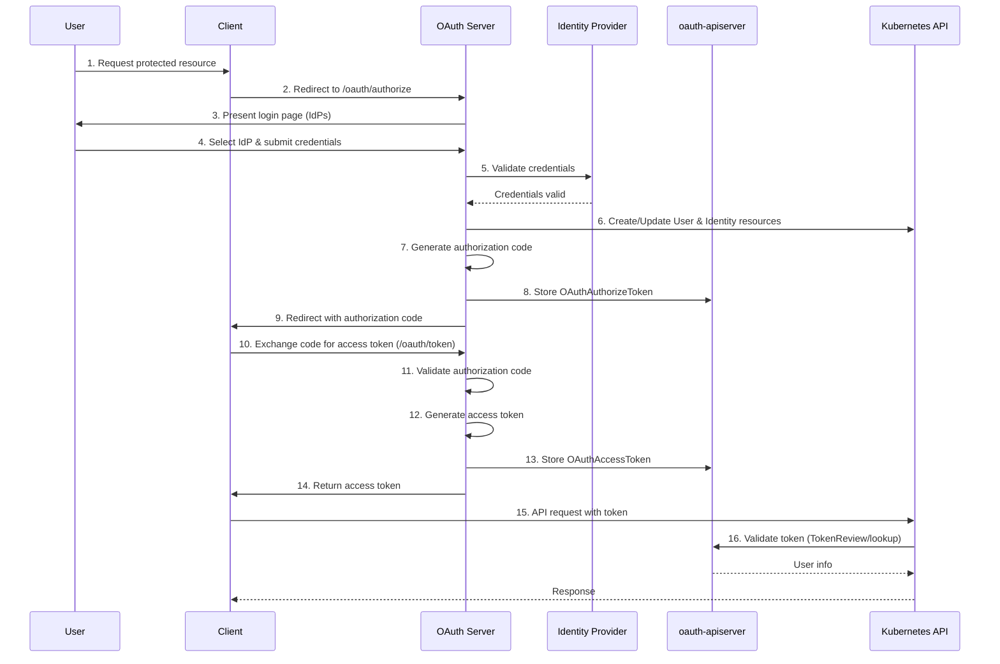
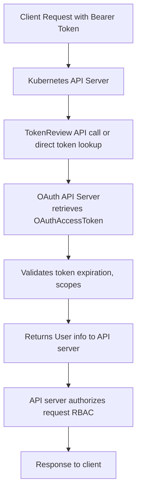
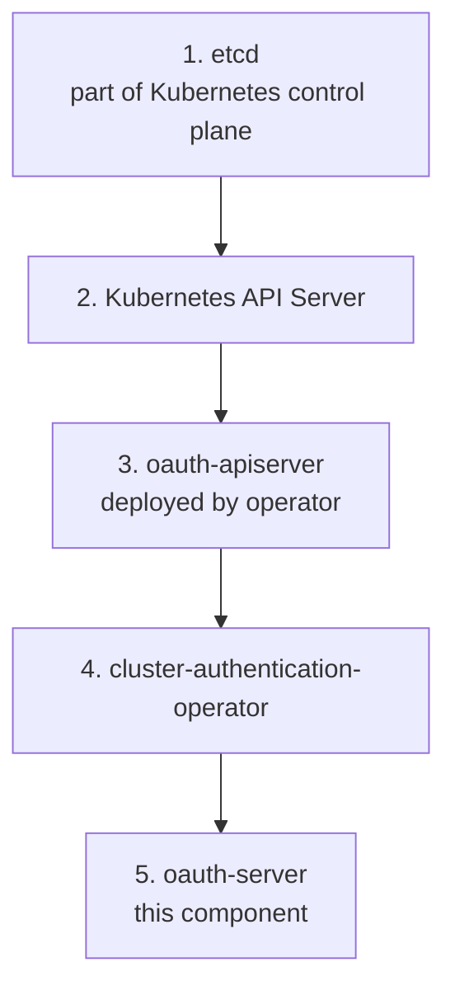

# ARCHITECTURE.md

## Overview

The OpenShift OAuth Server is a critical authentication component that handles user login and token issuance for OpenShift clusters. It implements OAuth 2.0 and OpenID Connect protocols to authenticate users against configured identity providers and issues access tokens for cluster API access.

**Repository**: https://github.com/openshift/oauth-server
**Deployed As**: `oauth-openshift` deployment in `openshift-authentication` namespace
**Managed By**: [cluster-authentication-operator](https://github.com/openshift/cluster-authentication-operator)

## Key Features

- **OAuth 2.0 Protocol Implementation**: Full support for authorization code, implicit, password, and client credentials grant flows
- **Multiple Identity Provider Support**: HTPasswd, LDAP, OpenID Connect, GitHub, GitLab, Google, Keystone, and Request Header authentication
- **Session Management**: Secure session handling with encrypted cookies
- **Token Lifecycle Management**: Token issuance, validation, and revocation
- **User and Identity Resource Management**: Automatic creation and mapping of Kubernetes User and Identity CRDs
- **Audit Logging**: Comprehensive authentication event logging for security compliance and forensic analysis

## System Context



## High-Level Architecture

### Core Components

1. **OAuth Server (`pkg/oauthserver/`)**
   - Main server implementation
   - Routes HTTP requests to appropriate handlers
   - Coordinates authentication flow
   - Built on Kubernetes apiserver libraries

2. **OSIN Server (`pkg/osinserver/`)**
   - OAuth 2.0 protocol implementation
   - Based on the [OSIN library](https://github.com/openshift/osin) (OpenShift's maintained fork)
   - Handles OAuth endpoints: `/oauth/authorize`, `/oauth/token`, `/oauth/token/request`, `/oauth/token/display`, `/oauth/token/implicit`
   - Token grant type handling (authorization code, implicit, password, client credentials)

3. **Authenticators (`pkg/authenticator/`)**
   - Pluggable authentication backends
   - Each identity provider type has its own authenticator implementation
   - Validates user credentials against external identity systems
   - Returns user identity on successful authentication

4. **Identity Providers** (configured via `Authentication.config.openshift.io/cluster`)
   - **HTPasswd**: File-based password authentication
   - **LDAP**: LDAP/Active Directory integration
   - **OIDC**: OpenID Connect provider integration
   - **Keystone**: OpenStack Keystone integration
   - **Request Header**: Proxy-based authentication
   - **GitHub**: GitHub OAuth integration
   - **GitLab**: GitLab OAuth integration
   - **Google**: Google OAuth integration

5. **User Registry (`pkg/userregistry/`)**
   - Manages user identity mapping
   - Interacts with OpenShift User/Identity CRDs
   - Creates/updates User and Identity resources

6. **Session Management (`pkg/server/session/`)**
   - Session cookie handling (via `github.com/gorilla/sessions`)
   - Session encryption and storage
   - CSRF protection (`pkg/server/csrf/`)

7. **API Integration (`pkg/api/`)**
   - Kubernetes API client integration
   - OAuth resource (OAuthClient, OAuthAccessToken, etc.) management
   - Communicates with oauth-apiserver

## Data Flow

### Authentication Flow (Authorization Code Grant)



### Token Validation Flow



## Key Design Decisions

### 1. Token Storage in etcd via CRDs

OAuth tokens are stored as Kubernetes Custom Resources (OAuthAccessToken, OAuthAuthorizeToken) in etcd, managed by the oauth-apiserver. This leverages Kubernetes storage infrastructure, enables RBAC-based access control and audit logging, allows kubectl-based token management, and ensures high availability through etcd clustering. Tradeoffs include performance overhead vs. in-memory storage and etcd storage limits.

### 2. Separation of OAuth Server and OAuth API Server

OAuth server handles authentication/authorization logic while oauth-apiserver manages OAuth resource CRDs. This follows the Kubernetes API aggregation pattern, separates protocol logic from resource management, and allows independent scaling. Tradeoffs include increased operational complexity and network latency between components.

### 3. Pluggable Identity Provider Architecture

Identity providers are implemented as pluggable authenticators with a common interface, supporting diverse enterprise authentication requirements and enabling new IdP types without core changes. Tradeoffs include varying configuration complexity and growing testing matrix.

### 4. Token Encryption at Rest

OAuth tokens stored in etcd are encrypted using AES-256 encryption keys to protect against etcd backup compromise. The OAuth server generates or reads encryption secrets for token storage. Tradeoffs include encryption/decryption performance overhead and key management complexity.

### 5. Session Cookie Security

Login sessions use encrypted, HTTPOnly, Secure cookies with SameSite protection to defend against XSS, MITM, and CSRF attacks. Cookies only work in browser contexts and require HTTPS.

### 6. OAuth 2.0 Protocol Implementation (OSIN)

Uses [OSIN library](https://github.com/openshift/osin) (OpenShift's maintained fork) for OAuth 2.0 protocol implementation. This provides a mature, well-tested implementation with storage abstraction adapted to Kubernetes CRDs. Tradeoffs include maintenance burden of the fork and limitation to OAuth 2.0 (not OAuth 2.1).

### 7. Audit Logging

All authentication attempts and token operations are logged to `/var/log/oauth-server/audit.log` following Kubernetes audit log format for security compliance, forensic analysis, and integration with cluster-wide audit infrastructure. Tradeoffs include disk I/O overhead and log rotation requirements.

## Component Interactions

### With cluster-authentication-operator

The operator manages the OAuth server lifecycle: creates/updates the `oauth-openshift` Deployment, syncs IdP configurations from `Authentication.config.openshift.io/cluster` to ConfigMaps/Secrets, manages TLS certificates and encryption keys, and monitors health via ClusterOperator status.

**Configuration Flow**:
```
Authentication CR (cluster scope)
   ↓
cluster-authentication-operator observes changes
   ↓
Operator creates/updates:
  - ConfigMaps in openshift-authentication namespace
  - Secrets in openshift-authentication namespace
  - Deployment spec (mounts updated configs)
   ↓
OAuth Server pods restart with new configuration
   ↓
OAuth Server reads config from mounted volumes
```

### With oauth-apiserver

The OAuth server acts as a client, creating and retrieving OAuthAccessToken/OAuthAuthorizeToken resources and reading OAuthClient resources for validation.

**API Calls**:
- `GET /apis/oauth.openshift.io/v1/oauthaccesstokens/{token-name}`
- `POST /apis/oauth.openshift.io/v1/oauthaccesstokens`
- `DELETE /apis/oauth.openshift.io/v1/oauthaccesstokens/{token-name}`
- `GET /apis/oauth.openshift.io/v1/oauthclients/{client-name}`

### With Kubernetes API Server

The OAuth server creates/updates User and Identity resources, reads Group resources for authorization, validates service account tokens, and uses SubjectAccessReview for RBAC checks.

### With Identity Providers (External Systems)

The OAuth server authenticates users against external identity systems: LDAP bind/search operations for LDAP/AD, OIDC discovery and token exchange for OpenID Connect, OAuth 2.0 flows for GitHub/GitLab/Google, Keystone API calls, local file validation for HTPasswd, and header extraction for Request Header providers.

## Security Architecture

### Threat Model

**Protected Assets**:
- OAuth access tokens (grant API access)
- User credentials (during authentication)
- Session cookies (maintain login state)
- Client secrets (for confidential OAuth clients)

**Trust Boundaries**:
1. **External → OAuth Server**: User credentials cross network boundary
2. **OAuth Server → etcd**: Tokens stored in etcd (encrypted at rest)
3. **OAuth Server → IdP**: Credentials forwarded to external IdP
4. **Client → OAuth Server**: OAuth flow crosses network boundary

**Key Threats**:
- **Token Theft**: Mitigated by HTTPS, short token lifetimes, token encryption at rest
- **Credential Theft**: Mitigated by HTTPS, no credential storage (except HTPasswd bcrypt hashes)
- **Session Hijacking**: Mitigated by HTTPOnly/Secure/SameSite cookies, CSRF tokens
- **Replay Attacks**: Mitigated by nonces, short-lived authorization codes
- **Man-in-the-Middle**: Mitigated by TLS everywhere, certificate validation

### Authentication Security

- **Password Storage** (HTPasswd): bcrypt hashed, never stored in plaintext
- **LDAP**: TLS connections enforced for production (configurable)
- **OIDC**: Token signature validation, issuer validation, nonce validation
- **OAuth Providers**: State parameter for CSRF protection, HTTPS redirect URIs only

### Token Security

- **Access Tokens**:
  - Random secure tokens (256-bit entropy)
  - Configurable timeout (default 24 hours)
  - Encrypted at rest in etcd (AES-256-GCM)
  - Invalidated on user deletion
  - Scopes limit permissions

- **Authorization Codes**:
  - Single-use only
  - Short-lived (5 minutes)
  - Bound to client and redirect URI

### Network Security

- **TLS Everywhere**: All HTTP endpoints require HTTPS
- **Certificate Management**: Certificates rotated by service-ca-operator
- **Mutual TLS**: Communication with API server uses client certificates
- **Ingress Control**: Only exposed via OpenShift Router (cluster-ingress-operator managed)

## Deployment Architecture

**Namespace**: `openshift-authentication` | **Deployment**: `oauth-openshift` | **Replicas**: 3 (scaled by cluster-authentication-operator)
**Service Account**: `oauth-openshift` | **Priority Class**: `system-cluster-critical`
**Pod Placement**: Master nodes only with anti-affinity for spreading across nodes
**Container**: Port 6443 (HTTPS), runs as root with privileged security context

### Volume Mounts

| Volume | Mount Path | Purpose |
|--------|-----------|---------|
| `audit-policies` | `/var/run/configmaps/audit` | Kubernetes audit policy configuration |
| `audit-dir` | `/var/log/oauth-server` | Audit log output directory |
| `v4-0-config-system-session` | `/var/config/system/secrets/v4-0-config-system-session` | Session encryption key |
| `v4-0-config-system-cliconfig` | `/var/config/system/configmaps/v4-0-config-system-cliconfig` | OAuth server configuration |
| `v4-0-config-system-serving-cert` | `/var/config/system/secrets/v4-0-config-system-serving-cert` | TLS serving certificate |
| `v4-0-config-system-service-ca` | `/var/config/system/configmaps/v4-0-config-system-service-ca` | Service CA bundle |
| `v4-0-config-system-router-certs` | `/var/config/system/secrets/v4-0-config-system-router-certs` | Router certificates |
| `v4-0-config-system-ocp-branding-template` | `/var/config/system/secrets/v4-0-config-system-ocp-branding-template` | Login page branding |

### Service Exposure

**Internal Service**: `oauth-openshift.openshift-authentication.svc:443`
**External Route**: `oauth-openshift.apps.<cluster-domain>` (managed by OpenShift Router)

**Endpoints**:
- `GET /oauth/authorize` - OAuth authorization endpoint (user login)
- `POST /oauth/authorize` - Authorization grant submission
- `POST /oauth/token` - Token endpoint (exchange code/credentials for token)
- `GET /oauth/token/request` - Display token request page
- `GET /oauth/token/implicit` - Implicit grant flow
- `GET /healthz` - Health check
- `GET /` - Login page

## Configuration

### Configuration File Format

The OAuth server reads configuration from a YAML file mounted at `/var/config/system/configmaps/v4-0-config-system-cliconfig/v4-0-config-system-cliconfig`.

**Key Configuration Sections**:
```yaml
oauthConfig:
  assetPublicURL: https://oauth-openshift.apps.<cluster-domain>
  loginURL: https://oauth-openshift.apps.<cluster-domain>/login
  masterCA: /var/config/system/configmaps/v4-0-config-system-service-ca/ca-bundle.crt
  masterPublicURL: https://api.<cluster-domain>:6443
  masterURL: https://api.<cluster-domain>:6443
  sessionConfig:
    sessionName: ssn
    sessionSecretsFile: /var/config/system/secrets/v4-0-config-system-session/v4-0-config-system-session
  tokenConfig:
    accessTokenMaxAgeSeconds: 86400  # 24 hours
    authorizeTokenMaxAgeSeconds: 300 # 5 minutes
  identityProviders:
    - name: <idp-name>
      challenge: true
      login: true
      mappingMethod: claim
      provider:
        apiVersion: v1
        kind: <HTPasswd|LDAP|OpenID|GitHub|...>
        # IdP-specific configuration
```

### Identity Provider Configuration Examples

**HTPasswd**:
```yaml
kind: HTPasswdPasswordIdentityProvider
file: /var/config/user/secret/htpasswd
```

**LDAP**:
```yaml
kind: LDAPPasswordIdentityProvider
url: ldaps://ldap.example.com:636
bindDN: cn=admin,dc=example,dc=com
bindPassword: <secret>
insecure: false
ca: /var/config/user/ca/ca.crt
attributes:
  id: [dn]
  preferredUsername: [uid]
  name: [cn]
  email: [mail]
```

**OpenID Connect**:
```yaml
kind: OpenIDIdentityProvider
issuer: https://accounts.google.com
clientID: <client-id>
clientSecret: <secret>
claims:
  preferredUsername: [email]
  name: [name]
  email: [email]
```

## Observability

### Metrics (Prometheus)

The OAuth server exposes Prometheus metrics on `/metrics`:

**Key Metrics**:
- `oauth_server_request_total` - Total OAuth requests by endpoint
- `oauth_server_request_duration_seconds` - Request latency histogram
- `oauth_server_authentication_total` - Authentication attempts by IdP and result
- `oauth_server_token_grant_total` - Token grants by grant type
- `oauth_server_error_total` - Errors by type

### Logging

**Structured Logging** (klog/v2):
- Log levels: V(2) - V(6) for debug logging
- Component: `oauth-server`
- Format: JSON structured logs

**Audit Logging** (Kubernetes audit format):
- Path: `/var/log/oauth-server/audit.log`
- Contains: All authentication attempts, token operations, user/identity changes
- Retention: Managed by cluster logging infrastructure

**Common Log Queries**:
- Failed login attempts: Filter audit logs for `auth` verb with failure status
- Token creation: Filter for `create` verb on `oauthaccesstokens`
- IdP-specific issues: Search for IdP name in error messages

### Health Checks

**Liveness Probe**: `GET /healthz` (checks server is responding)
**Readiness Probe**: `GET /healthz` (checks server can serve traffic)

**Health Dependencies**:
- oauth-apiserver reachable (token storage)
- Kubernetes API server reachable (user/identity management)
- etcd healthy (via Kubernetes API)

## Testing Strategy

### Unit Tests

- **Location**: Co-located `*_test.go` files in each package
- **Framework**: Go standard testing + `github.com/stretchr/testify`
- **Coverage**: Authenticator logic, token generation, session management
- **Mocking**: Fake Kubernetes clients, mock IdP backends

**Key Test Suites**:
- `pkg/oauthserver/auth_test.go` - OAuth flow logic
- `pkg/authenticator/` - Each IdP authenticator
- `pkg/oauth/` - Token and session handling

### Integration Tests

- **Scope**: End-to-end OAuth flows against real Kubernetes API
- **Environment**: Requires running Kubernetes cluster
- **Coverage**: Full authentication flows, token lifecycle

### E2E Tests

- **Repository**: Tests live in cluster-authentication-operator repo (`test/e2e/`)
- **Execution**: Run against deployed OpenShift cluster
- **Coverage**:
  - IdP configuration changes
  - Token encryption/rotation
  - Multi-replica deployment scenarios
  - Upgrade scenarios

## Deployment Dependencies

### Required Components (Hard Dependencies)

1. **oauth-apiserver** - Token and client storage
2. **Kubernetes API Server** - User/Identity/Group management
3. **etcd** - Backing store (via Kubernetes API)
4. **cluster-authentication-operator** - Lifecycle management

### Optional Components (Soft Dependencies)

1. **External Identity Providers** - Depends on configured IdP type
2. **OpenShift Router** - For external access (can use NodePort/LoadBalancer alternatively)
3. **service-ca-operator** - TLS certificate management (can use manual certs)

### Deployment Order



## Performance Characteristics

### Capacity

- **Requests per Second**: ~500 RPS per replica (depends on IdP latency)
- **Concurrent Sessions**: Limited by memory (session storage in-memory)
- **Token Count**: Limited by etcd size (typically 10,000s - 100,000s tokens)

### Scaling

- **Horizontal Scaling**: Stateless, scales horizontally by adding replicas
- **Bottlenecks**:
  - etcd write capacity (token creation)
  - IdP backend performance (authentication)
  - Network latency to oauth-apiserver

### Resource Usage

- **Memory**: ~100-200 MB per replica baseline
- **CPU**: Bursty (spikes during authentication, idle otherwise)
- **Disk I/O**: Audit logging (can be heavy during login storms)

## Future Architecture Considerations

### External OIDC Mode

**Status**: Implemented in cluster-authentication-operator (see `pkg/controllers/externaloidc/`)

**Impact**: When external OIDC is enabled:
- This OAuth server is **disabled** (deployment scaled to 0)
- Cluster uses external OIDC provider instead
- No OAuth API resources created (tokens managed externally)

### Known Limitations

1. **OAuth 2.0 Only**: Not OAuth 2.1 or OAuth 2.0 with PKCE (extension standard)
2. **Limited IdP Extensibility**: Adding new IdP types requires code changes
3. **Token Storage Scalability**: etcd-backed storage may hit limits at very large scale
4. **Session Storage**: In-memory sessions lost on pod restart (requires re-login)

### Potential Improvements (Not Planned)

- Distributed session storage (Redis/Memcached)
- OAuth 2.1 / PKCE support
- Plugin-based IdP architecture (external binaries)
- Token rotation for long-lived tokens
- Multi-factor authentication support

---

## References

- **OSIN Library**: https://github.com/openshift/osin
- **cluster-authentication-operator**: https://github.com/openshift/cluster-authentication-operator
- **OpenShift Authentication Documentation**: https://docs.openshift.com/container-platform/latest/authentication/
- **OAuth 2.0 RFC 6749**: https://datatracker.ietf.org/doc/html/rfc6749

## Document Maintenance

**Last Updated**: 2026-06-25
**Review Frequency**: Quarterly or when major architectural changes occur
**Owner**: OpenShift Authentication Team

**Update Triggers**:
- New IdP type added
- Major dependency version change (Kubernetes, Go)
- Security architecture changes
- External OIDC mode changes
- Deployment model changes
